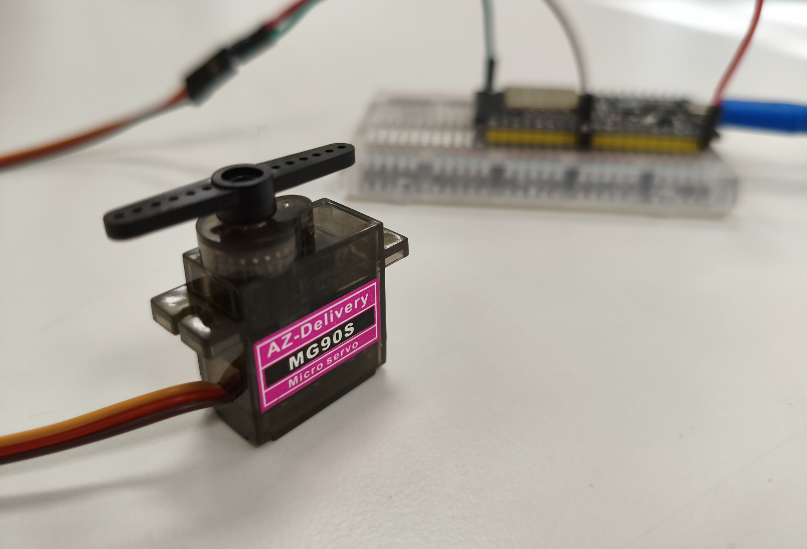

# 🤖 ESP32 Servo Motor Test (MG90S)

This project demonstrates **ESP32-based PWM control of a micro servo (MG90S)** using the **LEDC peripheral** in ESP-IDF.  
It’s inspired from [LTKDT's small projects](https://github.com/ltkdt/LTKDT-s_small_projects/blob/master/espidf_ledc_servo_control/main.c).

---

## ⚙️ Overview

The MG90S servo rotates based on PWM duty cycles:
- **50 Hz frequency** (20 ms period)  
- **1 ms pulse** → -90° (full left)  
- **1.5 ms pulse** → 0° (center)  
- **2 ms pulse** → +90° (full right)  

This script smoothly sweeps the servo back and forth by incrementally adjusting the duty cycle using FreeRTOS tasks.

---

## 🧩 Hardware Setup

| Component | Description |
|------------|-------------|
| **Microcontroller** | ESP32 (ESP-IDF framework) |
| **Servo Motor** | MG90S (micro servo) |
| **Power Supply** | 5V DC (from board or external) |
| **Control Pin** | ESP32 GPIO 25 |

---

## 🔌 Wiring

| ESP32 GPIO | Servo Pin | Notes |
|-------------|-----------|-------|
| GPIO 25 | Signal | PWM control |
| 5V | VCC | Servo power (5V) |
| GND | GND | Common ground |

---

### 🖼️ Example Setup



---

## 🧠 How It Works

The script uses **LEDC PWM** to control the servo position.  
- A **15-bit duty resolution** is used (`0..32767`)  
- Duty cycles are calculated to match servo positions:  
  - 1638 → full left (-90°)  
  - 3276 → full right (+90°)  
  - 2457 → center (0°)  

```c
// Smooth back-and-forth sweep
pos_direction ? (duty += step) : (duty -= step);
ledc_set_duty(LEDC_HIGH_SPEED_MODE, LEDC_CHANNEL_0, duty);
ledc_update_duty(LEDC_HIGH_SPEED_MODE, LEDC_CHANNEL_0);
vTaskDelay(iteration_time/portTICK_PERIOD_MS);
```